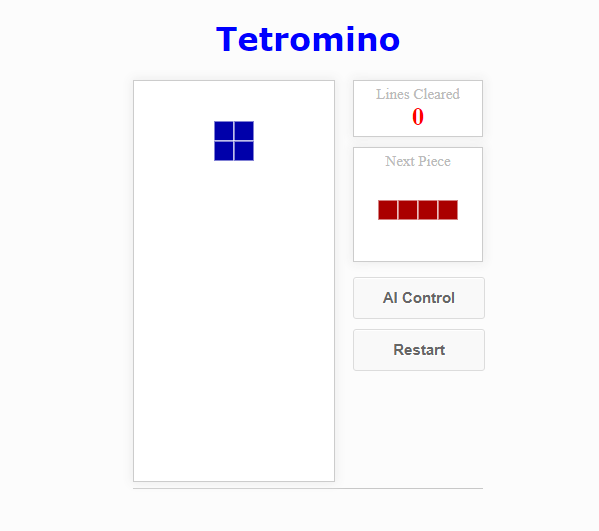

# Simple Tetromino (AI) Game using JavaScript

Simple Tetromino(AI) Game is a project that is a single-player game where your to form a horizontal line to get a score. The game has a simple design that draw a color blocks. The purpose of the provide fun and enjoyable time with your friends.

# About the System

The Simple Tetromino(AI) Game was developed in a HTML web browser that use JavaScript engine to extend the capability of the modern web application The game is playable through web browser that visualize the color blocks and the buttons. The player can play the game via keyboard binding (Up Arrow Key to Rotate the Block 90 deg., Right Arrow Key to Move Right, Left Arrow Key to Move Left, Down Arrow Key to Fasten the Drop Speed). The game can be play either AI or Player control it is depends on your choice. The score will automatically record after you successfully align the block horizontally. The game will be over when their are no space to place your blocks. The Simple Tetromino(AI) Game was created using basic JavaScript coding techniques that help beginners to program professionally.

# Features:
* Simple GUI
The project contains simple UI such text and images.
* Basic Controls
This project uses a basic control that needed to interact with the game.
* User-friendly Interface
This project was design in a simple user-friendly interface web application

# Installation:
1. Extract the zip file.
2. Find and locate the file "index.html".
3. Open the file in a web browser.

FOR YOUR OWN SAFETY, PLEASE:

1. Re-scan downloaded files using your personal virus checker before using it.
2. NEVER, EVER run compiled files (.exe's, .ocx's, .dll's etc.)--only run source code.
